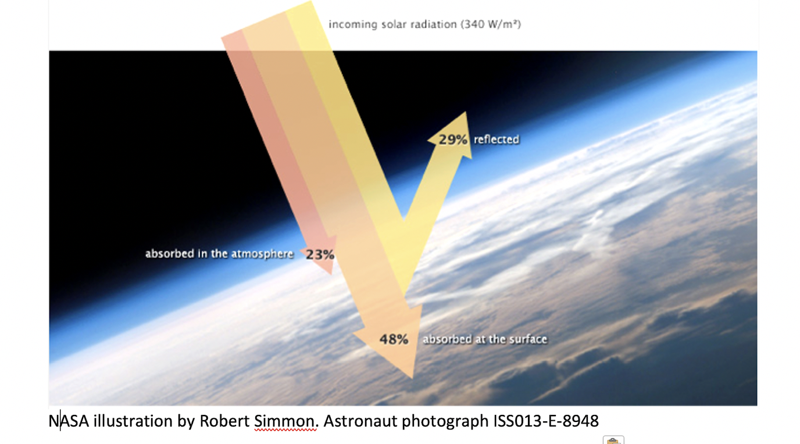
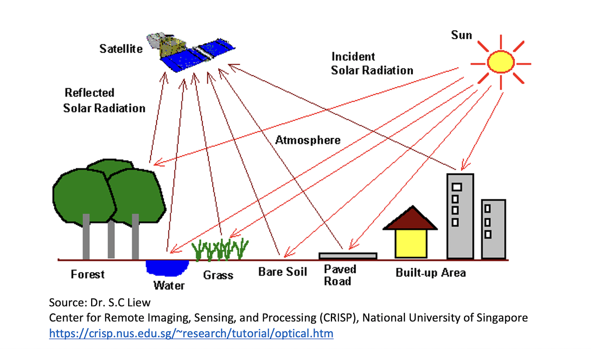
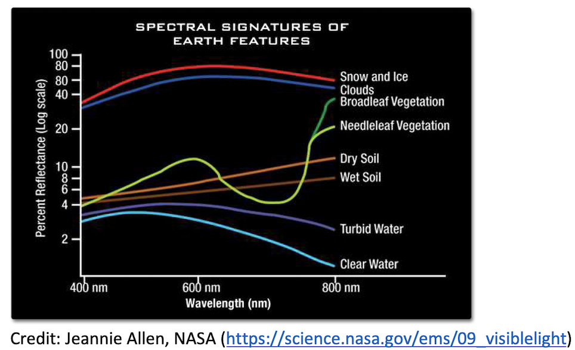
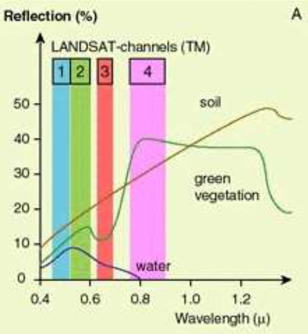

```{r setup, include=FALSE}
knitr::opts_chunk$set(echo = TRUE)
```

## Introduction and Roadmap

* <font size="6">Overview of basic remote sensing concepts </font>
* <font size="6">Google Earth Engine and geospatial "big data" </font>
* <font size="6">Tutorial: Working with satellite imagery products in R and GEE </font>

## Remote Sensing: Overview

* <font size="4">Remote sensing techniques allow us to learn about what activities and processes taking place on the earth's surface by extracting information about the radiation given off by objects on the earth's surface </font>
* <font size="4">A pixel in a satellite image contains information about the reflectance (at different parts of the electromagnetic spectrum) of surfaces or objects in the geographic area covered by that pixel; imagery datasets are therefore a type of raster. </font>
* <font size="4">"Remote sensing" refers to the process of collecting, extracting, visualizing, and analyzing this pixel-level reflectance data </font>
* <font size="4">Remote sensing techniques are used to create many of the off-the-shelf raster datasets that are widely used in applied work. For example, the population count rasters we worked with last class (clipped to NYC) are created by using remotely sensed data (that provides information on things such as land cover and night lights) that are fed into complex models that can make estimates about grid-cell population counts using these data (see [Stevens, Gaughan, Linard, and Tatem, 2015](https://journals.plos.org/plosone/article?id=10.1371/journal.pone.0107042)). </font>

## Remote Sensing: Collecting Data
1. Sunlight strikes the earth’s surface
2. Some of it is absorbed, and some reflected back into space, where it is recorded by a sensor on a satellite (but could also be a drone, weather balloon etc.)

```{r, echo=F, out.width='50%', out.height='50%'}
setwd("/Users/adra7980/Documents/git_repositories/ARSC5040_GIS_2024/class_notes/class4/rs_presentation")

```

## Remote Sensing: Collecting Data, continued
* <font size="3">Due to their different chemical compositions, different objects or surfaces reflect sunlight in different amounts at different parts of the electromagnetic spectrum. </font>
* <font size="3">In other words, various objects have different "spectral signatures", and these different spectral signatures are recorded by the sensor positioned on the satellite. We can use these differing spectral signatures to make inferences about what sort of object is within a given pixel in an image. </font>

```{r, echo=F, out.width='50%', out.height='50%'}
setwd("/Users/adra7980/Documents/git_repositories/ARSC5040_GIS_2024/class_notes/class4/rs_presentation")

```

## Remote Sensing: Visualizing spectral signatures

```{r, echo=F, out.width='50%', out.height='50%'}
setwd("/Users/adra7980/Documents/git_repositories/ARSC5040_GIS_2024/class_notes/class4/rs_presentation")

```

* <font size="3">This diagram is a visual representation of the differing spectral signatures of common objects found on the surface of the earth. </font>
  * <font size="3">For example, at a wavelength of 800nm (within the near-infrared region of the electromagnetic spectrum), snow and ice have high reflectance signatures, while clear water has a very low reflectance signature. We can use these differing spectral signatures to make inferences about what sort of object is within a given pixel in a satellite image. </font>

## Using spectral signatures to classify images/pixels: Identifying live vegetation
* <font size="3">Let's say you want to identify pixels in a satellite image with a high degree of live vegetation. </font>
* <font size="3">Different bands in a satellite image raster dataset correspond to different regions of the electromagnetic spectrum (these bands correspond to Landsat 7) </font>
* <font size="3">How could you use raster calculations to generate a new raster that will allow us to infer the amount of live vegetation in a given grid cell? Use the diagram below to inform your answer </font>

```{r, echo=F, out.width='25%', out.height='25%'}
setwd("/Users/adra7980/Documents/git_repositories/ARSC5040_GIS_2024/class_notes/class4/rs_presentation")

```

## The Normalized Difference Vegetation Index (NDVI)
* <font size="3">The intuition for the Normalized Difference Vegetation Index (NDVI) is basically what many of you would have inferred based on an examination of the spectral signature for natural vegetation. </font>
* <font size="3">Live vegetation (due to its cellular structure) reflects large amounts of energy in the near-infrared region of the spectrum (Band 4, in Landsat 7), but reflects relatively much less energy in the red region of the spectrum (Band 3, in Landsat 7).</font>
* <font size="3">The basic idea, then, is that we can subtract the reflectance values in the red band (Band 4) from the reflectance values in the near-infrared band (Band 7); where this difference is large in a given pixel, we can infer that it contains a large amount of live green vegetation (since a large difference is implied by green vegetation's spectral properties).</font> 
* <font size="3">Dividing this difference by the sum of the reflectances in these bands, yields a normalized vegetation index (i.e. the NDVI) where cell values range from -1 (no vegetation) to 1 (highest possible density of green vegetation).</font> 

## The Normalized Difference Vegetation Index (NDVI), continued

In equation form,

**NDVI**=$\frac{Near Infrared Band-Red Band}{Near Infrared Band + Red Band}$

If you were using a Landsat 7 image to derive the NDVI, this would mean

**NDVI**=$\frac{Band 4-Band 3}{Band4 + Band3}$

## Satellite imagery and "big data"

* <font size="4">In the hands-on exercise/lab, you will get some practice working with an NDVI raster; hopefully, you now have a sense of how the NDVI raster you'll work with was created using satellite imagery. </font>
* <font size="4">You'll also get some practice working with a land-use raster, which was also generated using satellite imagery, and use of differential spectral signatures to classify pixels with respect to various land uses. </font>
* <font size="4">While it is possible to work with satellite imagery, and the raster datasets derived from them, in R you may encounter problems stemming from the extremely large size of these datasets</font>
* <font size="4">If you need to process, visualize, calculate, or model with extremely large satellite and satallite-derived datasets, you may find yourself quickly running out of processing power on your local machine </font>

## Satellite imagery and "big data", continued
* <font size="4">In recent years, "big data" in the realm of remote sensing has rapidly transformed from obstacle to opportunity, with the emergence of high performancy computing and cloud data infrastructures that make it possible to process and analyze data at the petabyte scale. </font>
  * <font size="3"> Putting "big data" in perspective: Until very recently, only about 4% of the total Landsat data archive had actually been analyzed, given the lack of computational resources </font>
* <font size="4">If you find yourself needing these computational resources, one place to seek assistance is the [Research Computing](https://www.colorado.edu/rc/) department at CU </font>
* <font size="4">However, another option is to use [Google Earth Engine](earthengine.google.com), a "planetary-scale platform for Earth science data and analysis" developed by Google </font>
* <font size="4">Earth Engine is free for academic and non-profit use (though it requires registration), and effectively gives you the ability to tap into Google's supercomputing resources directly from your web browser. </font>

## The uses of Google Earth Engine 

* Data archive
* Useful when dealing with very large datasets, or you want to implement complex algorithms that require large amounts of computational power
* Visualization capabilities are less well-developed

## Remote Sensing: Social Science Applications

As you might imagine, remote sensing is an essential tool for earth scientists and other natural scientists interested in biophysical processes. While it hasn't traditionally been a commonly used method in social science, that is quickly changing: 

* Substantive research questions about the interaction between biosphere and society
* Research design (biophysical variables as possible exogenous sources of variation); see Donaldson and Storeygard (2016) for examples
* Provide information where official statistics are not reliable (i.e. North Korea)


## Tutorial

* Get some practice extracting and working with datasets derived from (MODIS) satellite imagery in R Studio
  * One section on NDVI
  * One section on land cover
* Exploring Google Earth Engine


